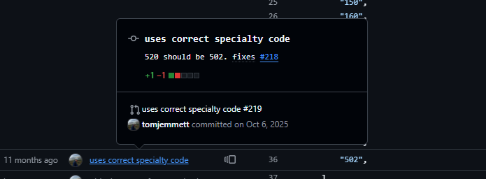
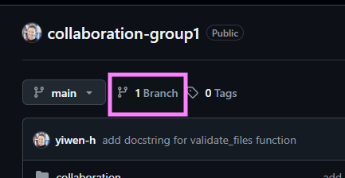
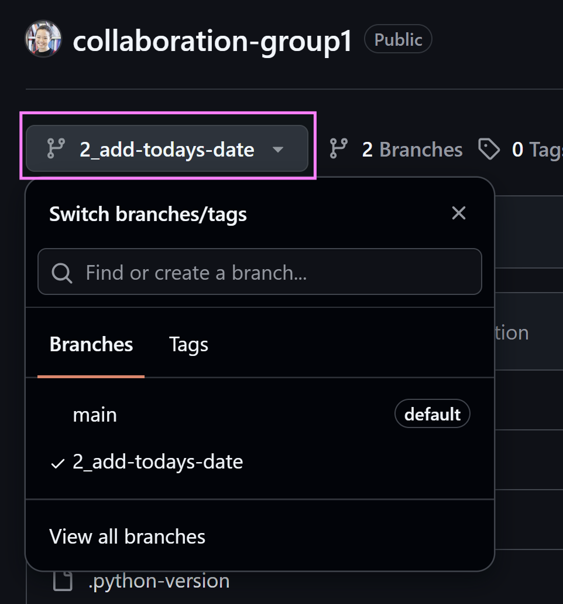
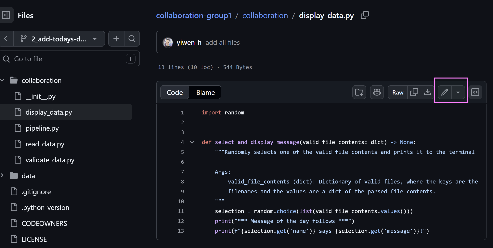
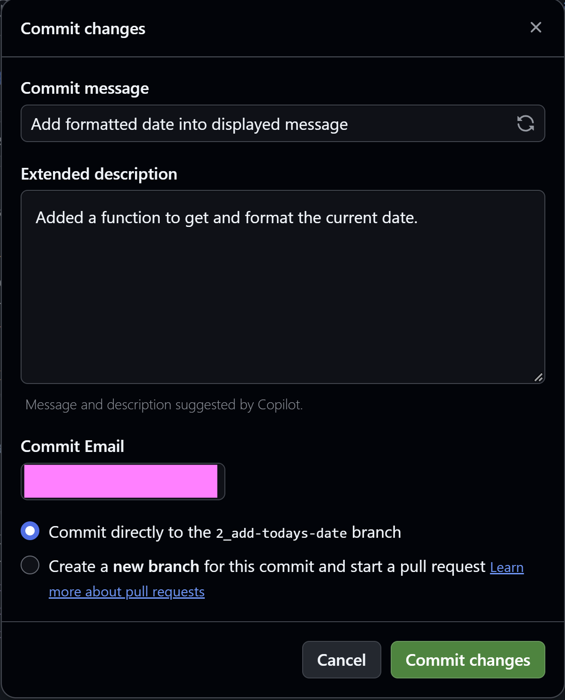
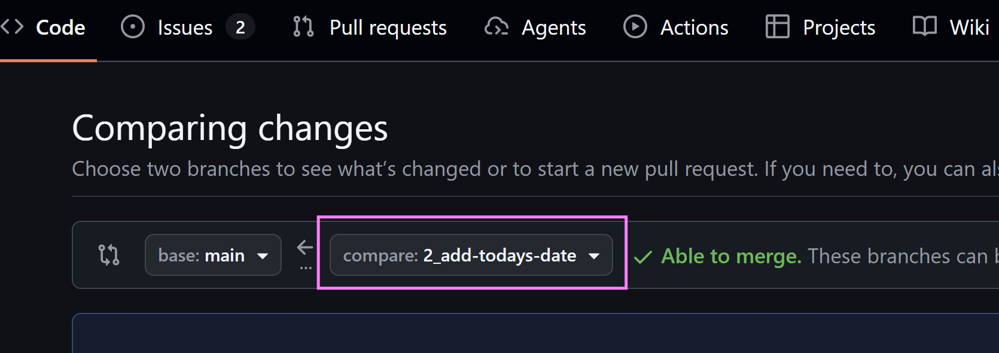
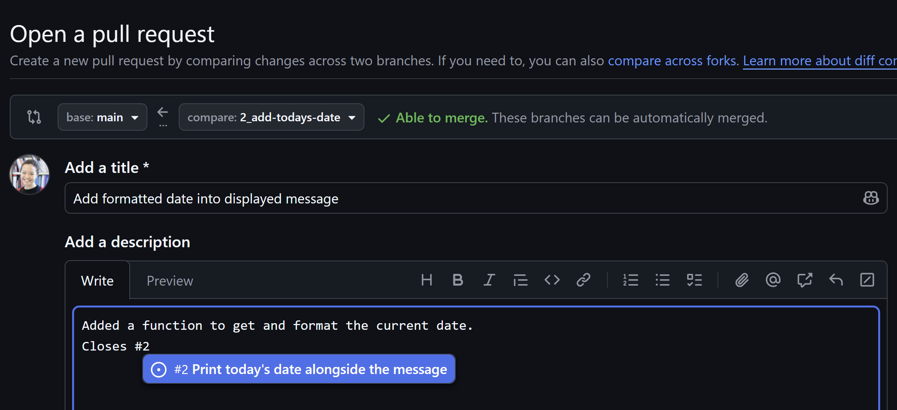

Analytical work never exists in isolation - it is always produced for or with other people.
Working on analytical projects collaboratively can sometimes be a messy experience due to differences in file versions between different computers, or losing track of which changes were made by whom.
Luckily, there are tools to help manage coding collaboration.

In this module, we will use Git and GitHub to practice working asynchronously on a project together. 

Using Git is complex, and a detailed guide would extend beyond the scope of this course.
This module will provide a basic high level overview focusing on the collaborative benefits of Git and GitHub.
You can explore more advanced usage in the optional further reading at the bottom of this page.

We will cover the following topics:

- Why use Git and GitHub?
- Managing work via GitHub issues
- Making your changes on a branch
- Sharing your changes with colleagues (pull request)
- Merging your changes once approved

## Why use Git and GitHub?

Git is a way of maintaining version control in your files.
GitHub is a commonly used platform that enables you to host Git repositories for free online.

📺 Watch [What is Git and GitHub?](https://www.youtube.com/watch?v=QzvA7r-WndM) (8 minutes) for a quick overview

Below are some practical examples of how Git and GitHub can be used to help solve common issues when working collaboratively with others.

### Tracking how code has changed over time

Sometimes, files change, and people don't know who made the change or when.
Git can help us to solve this problem, because each change is clearly marked with a timestamp and a person responsible.
Here's an example from [some code used in a data pipeline](https://github.com/The-Strategy-Unit/nhp_data/blame/main/src/nhp/data/raw_data/helpers.py).

If you scroll down to line 36, you can see that a change was made to this specific line to change one of the treatment specialty codes used for grouping to "502".
If you click on the square to the left of the number 36, you can also see the history of that line - what it looked like before the change was made.

Each change should be tracked in something called a **commit**, which is a snapshot of the code at a specific point in time.

{fig-alt="Screenshot showing git blame on a specific line on GitHub"}

### Maintaining a version of truth that remains stable

Many people working on the same files can sometimes cause conflicts.
Git helps us to avoid this by using a system of branches.
All Git repositories will have something called a `main` or `master`.[^1]
This is usually the primary version of the truth, which ideally should not be changed directly.

Instead, people working on the code should make a copy of the code in something called a **branch**.
They can then make their changes via commits on their separate branch, without harming the main branch.

[^1]: https://www.theserverside.com/feature/Why-GitHub-renamed-its-master-branch-to-main

### Quality assurance

When you are happy with the changes on your branch, you can request to incorporate them with the rest of the code in `main`.
This is done via a **pull request**.

One of the benefits of a pull request is that it is a built in quality assurance feature.
Team members can review each other's proposed changes before the changes are incorporated into the primary version of the truth on the `main` branch.

## Managing work via GitHub issues

1. Go to the repository for your group. You will be given collaboration rights to the repository.
 
- [Group 1 repository](https://github.com/yiwen-h/collaboration-group1)
- [Group 2 repository](https://github.com/yiwen-h/collaboration-group2)
- [Group 3 repository](https://github.com/yiwen-h/collaboration-group3)
- [Group 4 repository](https://github.com/yiwen-h/collaboration-group4)

2. In your repository, navigate to the Issues tab. You will see a list of different issues that need to be addressed in the repository. Each issue represents a specific task that needs to be completed.

    You have already been assigned to an issue.
    You can view issues that you have been assigned to by filtering by Assignees on a repository's list of issues, or by navigating to GitHub's [assigned issues page](https://github.com/issues/assigned).
    When you're assigned to an issue, it means that you will work on it.
    This prevents duplication of effort, and allows workflows and responsibilities to be clear.

3. Click on the title of the issue you have been assigned to.
The issue should be descriptive, and have details of what it is you need to do.
If you do not have enough information to be able to complete the task, you can add comments to the issue to help clarify the ask.
You can tag specific individuals with an @ symbol in issue comments, to bring your comment to their attention.

    If you understand your task, carry on to the next step and start working on your issue. In this example, I will be working on [this issue to add a new function](https://github.com/yiwen-h/collaboration-group1/issues/2).

## Making your changes on a branch

1. We need to create a branch to work on, because we don't want to disrupt the `main` branch. To do this, click on the `branches` button just under the repository name, as shown in the screenshot below. 



2. Click on the green `New branch` button on the right hand side. Give your new branch a name. Ideally, start the branch name with the number of the issue to help link your branch to the issue it addresses. Click "Create new branch" when you're ready.

3. Select your new branch to work on it. You can switch between branches by clicking on the branch icon below the repository name.



4. Navigate to the file that you need to change. Click on the pencil icon at the top of the file to start editing it. Make your changes to the file.



5. When you're happy with your changes, click on the big green Commit changes... button on the top right. A box will pop up asking you to add a commit message and extended description. Good commit messages are succinct but descriptive - something vague like "changes made" will not be helpful when you're reviewing it later! Click on commit changes when you're done.



## Sharing your changes with colleagues (pull request)

Your changes are ready to be merged with the `main` branch! You will now make your first **pull request**. Sometimes, pull requests are abbreviated to PR.

1. Click on the Pull requests tab at the top of the repository.

2. Click on the green `New pull request` button on the top right.

3. If not already selected, ensure that the `main` branch is on the left and the branch you were working on is on the right.



4. Click the green `Create pull request` button on the right.

5. If not automatically filled for you, provide a useful title and description for your pull request. You can also link to the issue that you were tackling in your issue in the description - use a # followed by the issue number to link them together.



6. On the right hand side of the page, there is an option to select Reviewers. Click on reviewers, search for yiwen-h from the list, and select the username.

7. Click on Create pull request. Your reviewer will be notified and should review your request within 3 working days.

When your pull request has been created, click on Files changed to see exactly what changes have been made.

## Merging your changes once approved

Sometimes, there can be an extended conversation around pull requests.
This is part of the quality assurance process. Reviewers can make suggestions to change the code, and provide comments. Jack Kennedy, a data scientist at the UKHSA, has written an excellent [guide to conducting code review](https://jcken95.github.io/projects/code_review.html).

Your pull request can either be approved, or changes can be requested. If changes are requested, you'll need to make the necessary changes and then re-request another review.

If your changes are approved, you can click on the big green `Merge pull request` button at the bottom of the screen. This will incorporate your changes into `main`.

## Before the session

Come prepared to discuss:

- What was your experience like working with Git on GitHub? 
- What benefits can you see from using Git and GitHub?
- How can you incorporate these tools into your existing workflows?

## Further reading (optional)

### More practice

There are some unassigned issues in your group repository. If you feel confident and want to practice more with Git and GitHub, feel free to assign yourself to these issues and work on them.

### Guide to writing good commits

📖 [Git commit message](https://github.com/joelparkerhenderson/git-commit-message/#git-commit-message) by Joel Parker Henderson

### Working on your own machine

We have been working on the GitHub web interface.
However, this only offers limited functionality and to really integrate Git into your everyday workflow, ideally you need to set it up on your local machine.

[Set up authentication between your computer and GitHub](https://se-education.org/guides/tutorials/githubAuthentication.html#setting-up-github-authentication). Choose __**either**__ SSH or HTTPS - you do not need both.

### Practice using the git command line interface (CLI)

Below is a sandbox to practice using git in the browser.
It is not a real git repository and no data is saved.
The exercise simulates how you would use the command line interface (CLI) in your computer terminal to enact some of the actions covered in this module, which we carried out on the GitHub web interface.


```git-sandbox
id: git-practice
title: Basic intro to the git CLI
prompt: "~/demo-project $"
intro: |
  Run the suggested commands below to perform specific tasks.
  Type {y}help{/} to see what the sandbox supports.
hints: [git status, git checkout -b docs, 'echo "A new line." >> README.md', git diff, git add ., 'git commit -m "Extend the README"'], 'git push'
done-note: You have created a new branch called `docs` and made changes to the README on your branch. Your changes are pushed to GitHub so colleagues can see them. The next step would be to do a Pull Request on GitHub.
seed: |
  git init
  echo "# Demo project" > README.md
  git add .
  git commit -m "Add the README"
  echo "library(tidyverse)" > analysis.R
  git add .
  git commit -m "Start the analysis"
tasks:
  - text: Ask where things stand with `git status`
    when: ran /^\s*git\s+status/
  - text: Create a new branch called `docs`
    when: branch docs
  - text: Change a file and find it in the Changes panel
    when: not clean
  - text: Add the file to your commit
    when: staged
  - text: Commit it and watch the history graph grow
    when: commits >= 3
  - text: Push your changes to GitHub
    when: pushed
```